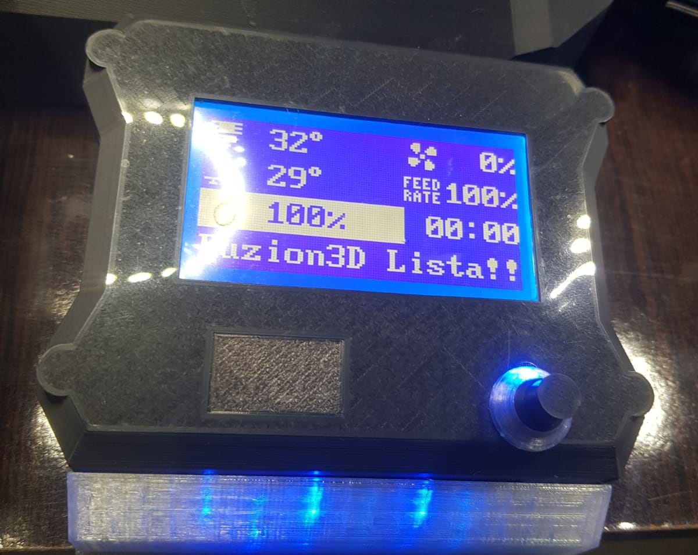
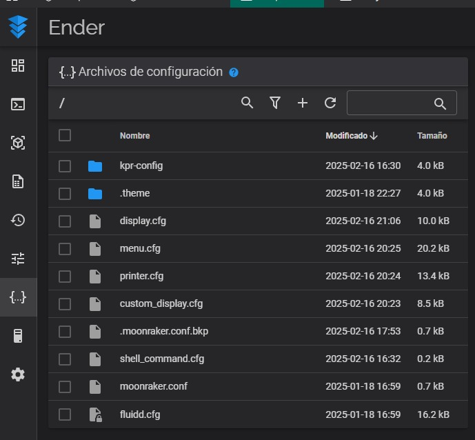
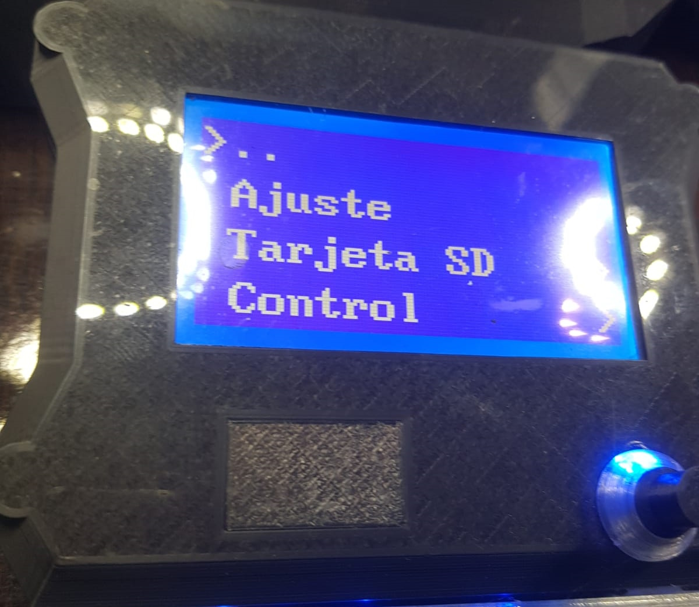

# 🖥️🔧 Personalización del Display ST7920 en Ender 3 con Klipper


<p align="center">
  
</p>

Este repositorio proporciona archivos de configuración (`.cfg`) para personalizar la pantalla LCD **ST7920** original de la **Ender 3** con **Klipper**. Gracias a estos ajustes, el display monocromático podrá:

✅ **Mostrar datos en tiempo real** de la impresión.  
✅ **Traducir el menú al español** para una mejor experiencia.  
✅ **Personalizar completamente** su contenido y apariencia.  
✅ **Incluir un splash screen editable** con la imagen de inicio que prefieras.  

---
## Descarga el RAR que contiene los cfg
[]([/cfg-s.zip])


## 📌 Verifica la compatibilidad  

Antes de comenzar, asegúrate de que tu pantalla es compatible. Debes agregar las siguientes líneas a tu `printer.cfg` si aún no están incluidas:

<p align="center">
  
</p>


## 📌 Verifica la compatibilidad  Placa SKR E3 V2
```ini
[display]
lcd_type: st7920                       # Tipo de pantalla LCD utilizado
cs_pin: EXP1_7                         # Pin de selección de chip (CS) para la pantalla
sclk_pin: EXP1_6                        # Pin de reloj (SCLK) para la pantalla
sid_pin: EXP1_8                        # Pin de datos en serie (SID) para la pantalla
encoder_pins: ^EXP1_5, ^EXP1_3         # Pines del codificador rotativo para el control del menú
click_pin: ^!EXP1_2                    # Pin de clic para el codificador (botón)
```

## 📌 Verifica la compatibilidad  Placa original 4.2.2/4.2.7
```ini
[display] # RET6 12864 LCD
lcd_type: st7920
cs_pin: PB12
sclk_pin: PB13
sid_pin: PB15
encoder_pins: ^PB14, ^PB10
click_pin: ^!PB2
```
💡 Si no funciona puede buscar los datos en google

---

📂 Archivos de configuración incluidos
Para habilitar las personalizaciones, deberás incluir estos archivos en tu printer.cfg:

```ini
[include menu.cfg]        # Configuración del menú traducido al español
[include display.cfg]     # Ajustes de visualización para la Ender 3
[include custom_display.cfg] # Personalización avanzada del display

```
<p align="center">
  
</p>

📂 Agrega los archivos .cfg en tu panel dnde tambien esta el ##printer.cfg##

---

<p align="center">
  
</p>


💡 Edición y personalización
Los archivos .cfg de este repositorio son totalmente editables, lo que te permite modificar su contenido y apariencia según tus necesidades. Sin embargo, es importante mantener la estructura del código para evitar errores en la interfaz del display.

---

🎨 Personalización del Splash Screen
También puedes cambiar la imagen de inicio (splash screen) del display, editando el archivo correspondiente en custom_display.cfg.

---
---
---

## 🔗 Recursos y Créditos
- 📄 [Documentación oficial de Klipper](https://www.klipper3d.org/)
- 💬 Soporte en [Klipperianos Whatsapp](https://chat.whatsapp.com/IHaUnmBsNPnJ1kDIenCrmT)

## 📢 Conéctate conmigo 📢

- 🔗 **TikTok:** [Fuzion3D](https://www.tiktok.com/@fuzion3d)
- 📸 **Instagram:** [Fuzion3D Crea](https://www.instagram.com/fuzion3dcrea)
- 🎥 **YouTube:** [Fuzion3D Crea](https://youtube.com/@fuzion3dcrea)
- 💬 **WhatsApp:** [Klipperianos Whatsapp](https://chat.whatsapp.com/IHaUnmBsNPnJ1kDIenCrmT)

Si encuentras útil esta macro, ⭐ ¡dale una estrella a este repositorio en GitHub! 🚀
